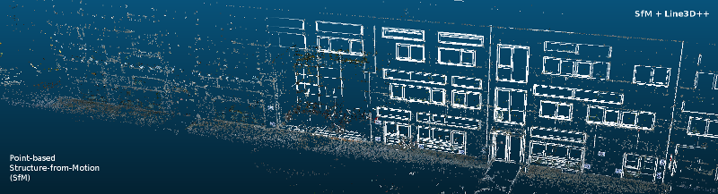

Line3D++
========

**Important information (2018/01/31):**
This software was implemented and tested in 2016. The stated support for various SfM pipelines (listed below) might not be valid anymore, since newer versions of the respective tools (e.g. colmap or Pix4D) might have changed their output formats since then. However, my current full-time occupation does not allow me to investigate this matter further, and to update the given interfaces to the supported SfM pipelines, or to add new interfaces. If you encounter problems of this sort feel free to contact me, but I am not sure if I will be able to assist you.
You can, of course, always just use Line3D++ as a library, and write your own interface to any given SfM output (see instructions below). I am more than happy to assist you with that. If you happen to create a new (working) interface to one of the already supported (or even a new) SfM pipeline, feel free to create a pull request so I can integrate it into the code.

About
=====

Line3D++ is a line-based Multi-View Stereo (MVS) algorithm written in C++, that can generate 3D line models from oriented image
sequences (e.g. Structure-from-Motion results). 

It is designed as a shared library, that can be linked to an arbitrary 3D reconstruction application. You can easily generate line-based
3D models by simply feeding it the camera poses and corresponding images.

For your convenience, there are several example executables included that can directly process the output of the following SfM pipelines:

* VisualSfM - http://ccwu.me/vsfm/
* bundler   - http://www.cs.cornell.edu/~snavely/bundler/
* Pix4D     - https://pix4d.com/
* mavmap    - https://github.com/mavmap/mavmap/
* OpenMVG   - https://github.com/openMVG/openMVG/
* colmap    - https://github.com/colmap/colmap

More information about Line3D++ and its usage can be found below.

If you use our algorithm in any of your publications or projects, please cite our paper:

    Hofer, M., Maurer, M., and Bischof, H.:
    Efficient 3D Scene Abstraction Using Line Segments,
    In Computer Vision and Image Understanding (CVIU), 2016.
    http://dx.doi.org/10.1016/j.cviu.2016.03.017

Requirements
============

**Basic:**

* CMake (to generate the Makefiles)
* Boost
* Eigen3
* OpenCV
* tclap (for the executables only)

**Optional (but recommended!):**

* CUDA (optional)
* OpenMP (optional)
* Ceres-Solver (optional, **must be built as shared library on UNIX systems!**)
* RapidJSON (optional, for OpenMVG executable only)

The code has been tested under **Ubuntu 14.04 LTS** with the following versions:

* Boost==1.55.0
* Eigen==3.2.0
* OpenCV=={2.4.10, 3.0}
* CUDA=={5.0, 5.5, 6.0}
* Ceres-Solver=={1.8.0, 1.12.0}

Basically, the Ubuntu system packages should be fine (whenever available). Building on Windows or MacOS systems should be possible as well
with the provided `CMakeLists.txt`, but it has not been tested by us!

We highly recommend that you also install the optional requirements (especially CUDA, if possible), which significantly boosts the performance and
also improves the quality of the 3D model (when the Ceres-Solver is available).

Building on Linux Systems
=========================

When all required libraries and CMake are properly installed, building the Line3D++ library and the executables should be straightforward.
Just open a terminal in the Line3D++ source directory and type:

    mkdir build
    cd build
    cmake ..
    make

You can change the compile settings (i.e. whether to use CUDA or not) by using CMake. Most comfortably, you can do this using the CMake GUI (Ubuntu package: `cmake-qt-gui`).

**Note:** If you get compile errors that say something like `data.__outbuf[-1] == '\0'`, or linker errors that have something to do with shared libraries, the most probable cause is that the CERES-Solver was not built as a shared library, but a static one (default in version 1.8.0). You have to change this in the `CMakeLists.txt` of CERES (`BUILD_SHARED_LIBRARIES`), or disable CERES for Line3D++ (--> CMake).

Building on Windows Systems
===========================

In contrast to Linux systems (see above), building on Windows is usually slightly more complicated. We know that it runs on **Windows 10** with the **MinGW** (http://www.mingw.org/) build environment. We also tried to build it with **Visual Studio 2015**, but ran into some unresolved problems with OpenMP and Eigen. However, if you have a sane build environment and you set the following CMake variables properly, building should be no problem.

### OpenCV
Set `OPENCV_DIR` to the build folder of your OpenCV installation.

### Eigen
Set `EIGEN3_ROOT_DIR` to the include (root) directory of your Eigen3 installation.

### Boost
Set `BOOST_LIBRARY_DIR` to the lib directory of your boost installation, and `BOOST_INCLUDE_DIR` to the directory with the boost headers.

### tclap
Set `TCLAP_INCLUDE_DIR` to the tclap include directory (does not require an installation).

These variables should be enough to build a basic version of Line3D++ (without CUDA and Ceres). We were not able to try CUDA and Windows, since our testing environment does not have an nVidia graphics card. However, the included CMake configuration file should be able to properly identify a valid CUDA installation on its own. If not, please drop us a message.

The last thing is the Ceres solver. It is not an incredibly important part of the pipeline, but can potentially improve the results by a small margin.

### Ceres
Set `CERES_LIBRARY` to the `ceres.lib` file, and `CERES_ROOT` to the ceres include directory. There is also a precompiled version of the `ceres.lib` available in the libs folder, but it only works for **64bit** environments! Either way, the two libraries **gflags** (http://gflags.github.io/gflags/) and **glog** (https://github.com/google/glog) must be properly installed (you can set the respective lib/include directories in CMake as well).

**Note:** You can disable Ceres, OpenMP, or CUDA in CMake in case that one of these components is not found (or can't be installed). In addition, the Line3D++ basic library is built as a **static library** on Windows, since this seems to be less problematic with linking etc. If you run into any problems, or have any suggestions how we can improve the `CMakeLists.txt` for Windows systems, just send us a message. 

License
=======

This software is published under the **GNU General Public License**. More information can be found here: http://www.gnu.org/licenses/

Usage
=====

There are two ways of using Line3D++:

1. As a library
2. Using the provided executables

## 1. Library use

If you want to use Line3D++ as a shared library (`libline3Dpp.so`) with your own application, you have to add the source **and the binary (build) directory** to your include directory list!
(a dynamically generated header file `configLIBS.h` is placed in the build directory when CMake is executed).

To perform the line-based 3D reconstruction you need to follow these steps:

Include the main header:

	#include "line3d.h"

Create the Line3D++ object:

	L3DPP::Line3D* Line3D = new L3DPP::Line3D(...);

**Note:** All images need to be **undistorted**! If they are not, you can use the following function to undistort them
(given that you have the proper distortion coefficients at hand):

	Line3D->undistortImage(...);

Feed the images into the system (multi-threading safe!):

	Line3D->addImage(...);

Match 2D line segments between the added images:

	Line3D->matchImages(...);

Reconstruct the 3D model:

	Line3D->reconstruct3Dlines(...);

Get/save the result:

	Line3D->get3Dlines(...);
	Line3D->saveResultAsSTL(...);
	Line3D->saveResultAsOBJ(...);
	Line3D->saveResultAsTXT(...);

All parameters that are necessary are explained directly above the function definitions in the `line3d.h` main header.

If you are unsure about this process just have a look at one of the generic executables (e.g. `main_vsfm.cpp`). Here, all these methods are appropriately called with various SfM outputs.

## 2. Executable use

If you are using one of the supported SfM pipelines, you can simply use one of the provided executables to generate a line-based 3D model with the SfM output. Since all these pipelines
work slightly different, and have non-standardized output formats, the call of the executables varies as well.

**Note:** If distortion coefficients are stored in the respective SfM result files, you need to use the original images! Line3D++ will use these coefficients to undistort the images automatically.

### VisualSfM

This executable reads VisualSfM results in the form of an `.nvm` file (parameter `-m` below).

	./runLine3Dpp_vsfm -m <full_path_to_nvm_file> [-i <image_folder>] 

### bundler

This executable reads bundler results in the form of a `bundler.rd.out` file.

	./runLine3Dpp_bundler -i <image_folder> -b <full_path_to_bundle_file> [-t <image_extension>]

### Pix4D

This executable reads Pix4D results as the are stored in the `<project_prefix>/1_initial/params/` folder (parameter `-b` below).

	./runLine3Dpp_pix4d -i <image_folder> -b <pix4d_output_params_folder> -f <project_prefix>

### mavmap

This executable reads mavmap results in the form of a `image-data-*.txt` file (parameter `-b` below).

	./runLine3Dpp_mavmap -i <image_folder> -b <full_path_to_mavmap_output_file> [-f <image_prefix> -t <image_extension>]

### OpenMVG

This executable reads OpenMVG results in the form of an `sfm_data.json` file (parameter `-j` below).  
**Note:** This executable is only available when [RapidJSON](https://github.com/miloyip/rapidjson) is properly installed.

	./runLine3Dpp_openmvg -i <image_folder> -j <full_path_to_sfm_data_file>

### colmap

This executable reads colmap results in the form of three txt files `cameras.txt`, `images.txt`, and `points3D.txt`, stored in an sfm result folder (`-m`).
If the result folder is not specified, it is assumed that these files are located in the image folder (`-i`).

	./runLine3Dpp_colmap -i <image_folder> [-m <sfm_result_folder>]

All additional command line parameters are optional. They correspond to the parameters of the algorithm itself, and their meaning can be found in the `line3d.h` main header
(above the function definition, in which the parameters are needed). In addition, the most important parameters are listed below.

Testing
=======

To test the Line3D++ algorithm, a small test dataset is included in the folder `Line3D++/testdata/`. It consists of 26 images that have been processed by the VisualSfM pipeline. To run Line3D++ on this dataset just run the following command from the build folder:

	./runLine3Dpp_vsfm -i ../testdata/ -m ../testdata/vsfm_result.nvm

The results will be placed in `Line3D++/testdata/Line3D++/`, and the reference results are located in `Line3D++/testdata/Line3D++_ref/` (with and without CERES optimization). See the "Output" section below on how to open and view the results.

Important parameters
====================

Detailed information about all parameters can be found in the `line3d.h` main header. We explain the most important ones here as well, to simplify the usage of Line3D++ and to give some hints about how to obtain
satisfactory 3D models. 

**Spatial regularizer** `-p` [`--sigma_p`] (`float`):

This parameter defines the spatial uncertainty that is allowed to cluster 2D lines from different images. By default, the parameter is in pixels, since the reconstruction scale may be unknown.
However, if you have a metric SfM result you can also use a metric value instead. To do so, just add a negative sign (`-`) in front of the value (e.g. `-p -0.05`, for a 5cm spatial uncertainty).
In general, higher values result in a denser 3D model with the increased risk of introducing outliers, while smaller values lead to a sparser result. Especially when you work with very large images or when the camera is very close to the scene you might need to increase the default value of 2.5 pixels to get a satisfying result.

**3D line optimization** `-c` [`--use_ceres`] (`bool`):

If this parameter is activated the 3D lines are optimized (*bundled*) by minimizing their reprojection error. This only works when the Ceres-Solver is installed! It is generally recommended to use
this option, since it results in more accurate 3D models.

**Minimum number of images per line cluster** `-v` [`--visibility_t`] (`int`):

By default only 3D lines are considered valid if they are seen in at least three different cameras (i.e. if they have 2D residuals from at least three images). You can change this value using this parameter. Please note that a minimum of three images is always required, since triangulations from just two lines (from two images) can not be verified. If you have a large number of images you can safely increase this value without risking that the reconstruction will turn out to be incomplete, but with a lower risk of outliers.

**Nearest neighbor line matching** `-k` [`--knn_matches`] (`int`):

Line matching in our algorithm is done based on epipolar constraints, without appearance. For an increase in performance, we only consider the k-nearest neighbors as potential matches (with respect to the epipolar overlap). By default k is set to 10. If you want to keep all matches that pass the overlap test, just set k to -1. This might increase the number of reconstructed 3D lines, with a slightly higher runtime.

**Load and store 2D lines** `-l` [`--load_and_store_flag`] (`bool`):

If this parameter is set, the detected 2D line segments are stored in the data folder, and reloaded if the dataset is processed again. This significantly increases the performance after the first run. By default this option is enabled.

**Maximum image width for line detection** `-w` [`--max_image_width`] (`int`):

For an increase in performance, one can reduce the size of the input images during the line segment detection step. For the general case, this does not influence the accuracy or the completeness of the results by a large margin, as long as the images are not made too small. If the parameter value is negative (e.g. `-w -1`) the images are not resized, and the algorithm performs on full resolution (default). However, even when you resize the images the 2D line segment coordinates are upscaled to the full image dimensions. We do not recommend to resize the images to less than approximate FullHD resolution (`-w 1920`), if you aim for accurate reconstruction results.

Output
======

The 3D line model is by default stored in three different ways:

* `.stl` file
* `.obj` file
* `.txt` file

The files are by default placed in the folder `<image_folder>/Line3D++/`, and named according to the parameters that were used to create the result.

The `.stl` file can be opened e.g. in [Meshlab](http://meshlab.sourceforge.net/). If you do so, you should see a window which states "Post-Open Processing". You have to
untick the option "Unify Duplicated Vertices" and press OK. Then switch to "Wireframe", "Hidden Lines" or "Flat Lines" mode and you should see a result.

The `.obj` file can be opened e.g. in [CloudCompare](http://www.danielgm.net/cc/).

The `.txt` file contains the reconstructed 3D lines and their visibility information in the following format (one line in the file per resulting 3D line):

	n P1x P1y P1z Q1x Q1y Q1z ... Pnx Pny Pnz Qnx Qny Qnz m camID1 segID1 p1x p1y q1x q1y ... camIDm segIDm pmx pmy qmx qmy

The first `n` stands for the number of 3D segments on the 3D line. It is followed by the coordinates of the start- (`P`) and endpoints (`Q`) of these 3D segments.
The `m` stands for the number of 2D residuals. It is followed by the camera ID, segment ID and the 2D coordinates of the segments (**Note:** the 2D coordinates refer to the **undistorted** images).

Disclaimer
==========

Our algorithm uses three external components, which are integrated into the source code for your convenience:

**[LSD - Line Segment Detector](http://www.ipol.im/pub/art/2012/gjmr-lsd/):**

	A Fast Line Segment Detector with a False Detection Control,
	R. von Gioi, J. Jakubowicz, J.M. Morel, G. Randall,
	Transactions on Pattern Analysis and Machine Intelligence (PAMI), 2010.

**[Graph-based Segmentation](http://cs.brown.edu/~pff/segment/):**

	Efficient Graph-based Image Segmentation,
	P. Felzenszwalb, D. Huttenlocher,
	International Journal of Computer Vision (IJCV), 2004.

**[Replicator Dynamics Diffusion](http://vh.icg.tugraz.at/index.php?content=topics/rgcclustering.php):**

	Replicator Graph Clustering,
	M. Donoser,
	British Machine Vision Conference (BMVC), 2013.

All three algorithms are publicly available, for which we are very grateful to the respective authors.
If you are using **OpenCV 3** the LSD version that is included in OpenCV is used instead of the version that is integrated into our source code (they should be identical).

Acknowledgements
================

This work has been supported by the Austrian Research Promotion Agency (FFG) project FreeLine (Bridge1/843450).
It was done during my time as a PhD student at the Institute for Computer Graphics and Vision at Graz University of Technology (Austria).

Contact
=======

If you have any problems, questions or suggestions please do not hesitate to contact me! Also if you find some bugs please let me know!

**Main contact:**

Manuel Hofer  
Senior Computer Vision Engineer @ Naked Labs  
mail: man.hofer [at] gmail.com  
web:  http://naked.fit/  
